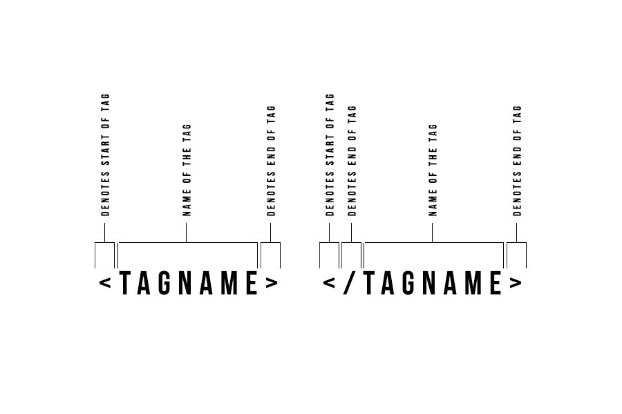

# Basic 

## HTML Tags

What is a website? A website is a compilation of webpages, these webpages comprise of html, html is a set of markup/tags. What are html tags? Simply put they are a set of textual input that represent kinds of tags. The graphic below illustrates the various parts of the tag.

[](tutorial-assets/img/html-tag-explanation.jpg)

#### Hierarchy
HTML is very much like a tree structure, for instance with a tag like the `body` you may multiple child tags like `div` tags. Inside of those `div` tags maybe other child `div` tags and really any other html tag you could want to use. This parent child relationship is how we can understand what elements belong to what. Below is a small example:

```html
<body>
  <div id="parent">
    <div class="child-item"></div>
    <div class="child-item"></div>
    <div class="child-item">
      <div class="other-child-items"></div>
      <div class="other-child-items"></div>
      <div class="other-child-items"></div>
    </div>
  </div>
</body>
```

Here you can see that the body has one child item `#parent`, which has three `.child-item` divs and the last one has 3 other `.other-child-items` divs inside it. This is denoted by wrapping the child elements with the parent tags starting and ending tag.

## CSS
Styles are what describe the visual style of these elements. They use selectors with style rules to define how each html element should look. By default browsers apply a base level of styling just for your info.

#### Cascade meaning
Stylesheets and styles are called cascading stylesheets because they allow for styles to be overwritten, ie styles define at the top of the page will be overwritten by styles written below at the end of the file. This can be avoided depending on selectors, selectors with more specificity are typically more likely to override selectors with less specificity.  

#### Style formats
Rules follow the following format:

[](tutorial-assets/img/css-explanation.jpg)

```
selector {
    ...rules
}
```

#### Selectors 
Are typically broken down into three main categories:
- tagName
- id
- class

For instance:

```css
tagName {
   ...rules
}

#id {
   ...rules
}

.class {
   ...rules
}
```

So let's create a basic example, consider that you have the following html markup:

```html
<div class="row"></div>
<h1 id="header-text"></h1>
<p>Some text</p>
```

Here is an example of how you can target the following:

```css
.row {
   ...rules
}

#header-text {
   ...rules
}

p {
  ...rules
}
```

#### CSS Rules
Now that we know what selectors are let's look at rules, rules are made of two parts, the name of the rule and the rules value. Take this example, we'll write a rule that sets the style of a `font-size` to `22px`:

```css
font-size: 22px
```

So for example let's say we have the following markup:

```html
<p>Some random text</p>
```

Now lets write the full css to apply a `font-size` of `22px` to this paragraph tag:

```css
p {
  font-size: 22px;
}
```

Let's add a bunch of rules to the `p` tag:

```css
p {
  color: red;
  margin: 20px 0;
  font-size: 22px;
  line-height: 150%;
}
```

#### Multiple classes
We should also note that attributes can have multiple values, this is specifically helpful with classes. Let's use example markup:
```html
<div class="container"></div>
```

We can target this in css like this:
```css
.container {
  ...rules
}
```

But we could also have multiple classes on the same element like this, note that each class name is separated by a space. Also keeping in mind that `classes` and `ids` cannot contain spaces inside of the name, it's better to use camelcase, `-` or `_` here we used `-`:
```html
<div class="container second-class third-class"></div>
```

We can target and add styles like this:
```css
.container {
  ...rules
}

.second-class {
  ...rules
}

.third-class {
  ...rules
}
```

#### CSS defaults
Every rule has a default value, there are also cases where if a certain rule is set, with a specific value, that it will inherently receive other rules by default. A very specific case of this is `display: flex`. If you set an element to `display: flex` it also receives by default a `flex-direction` which has a default of `row`. So if you set an element to `display: flex;` it will inherently receive `flex-direction: row;` by default without you having to explicitly write or set this.
