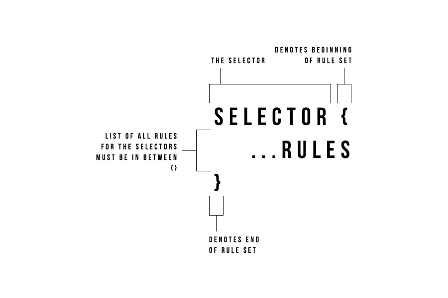

# Basic 

### HTML Tags

What is a website? A website is a compilation of webpages, these webpages comprise of html, html is a set of markup/tags. What are html tags? Simply put they are a set of textual input that represent kinds of tags. The graphic below illustrates the various parts of the tag.

[](tutorial-assets/html-tag-explanation.jpg)

### CSS
Styles are what describe the visual style of these elements. They use selectors with style rules to define how each html element should look. By default browsers apply a base level of styling just for your info.

Style rules follow the following format:

[](tutorial-assets/css-explanation.jpg)

```
selector {
    ...rules
}
```

Selectors are typically broken down into three main categories:
- tagName
- id
- class

For instance:

```css
tagName {
   ...rules
}

#id {
   ...rules
}

.class {
   ...rules
}
```

So let's create a basic example, consider that you have the following html markup:

```html
<div class="row"></div>
<h1 id="header-text"></h1>
<p>Some text</p>
```

Here is an example of how you can target the following:

```css
.row {
   ...rules
}

#header-text {
   ...rules
}

p {
  ...rules
}
```

Now that we know what selectors are let's look at rules, rules are made of two parts, the name of the rule and the rules value. Take this example, we'll write a rule that sets the style of a `font-size` to `22px`:

```css
font-size: 22px
```

So for example let's say we have the following markup:

```html
<p>Some random text</p>
```

Now lets write the full css to apply a `font-size` of `22px` to this paragraph tag:

```css
p {
  font-size: 22px;
}
```

Let's add a bunch of rules to the `p` tag:

```css
p {
  color: red;
  margin: 20px 0;
  font-size: 22px;
  line-height: 150%;
}
```