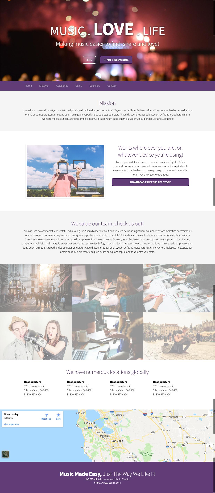
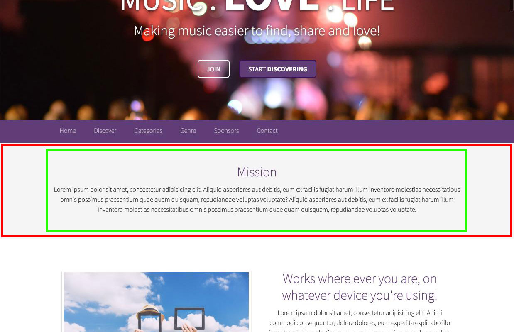

# Tutorial

We'll be building this example website:

[](img/sample-full-finished-example.jpg)

To run this code and view it, go into your command prompt and cd into this directory then run this command:

`php -S localhost:8000`

#### Step 1 
- Create an index file, for this tutorial we'll use the `.php` extension so that you can make use of some basic php scripting.
- So in the root directory create a `index.php` file and save it.
- Next inside the `css` directory create a `app.css` file.

These are the basic files you will need to get started.

#### Step 2
- Open up your `index.php` file and let's put a basic boilerplate of code:

```html
<!doctype html>
<html>
<head>
<title>My example</title>
</head>
<body>

</body>
</html>
```

- Let's also link to your stylesheet so that the styles can be reflected inside your `index.php`

```html
<!doctype html>
<html>
<head>
<title>My example</title>

<link rel="stylesheet" href="css/app.css" />
</head>
<body>

</body>
</html>
```

So if we look at the example image, we can basically break the website down into 9 sections:

- Hero section
- Navigation
- Mission
- Device info
- Team about section
- Culture image section
- Locations
- Map
- Footer

If you look at the design we will notice that there are essentially two containers around each section. There is an outside container that spans the full width of the viewable area and an inside container that holds the content within 1170px and centered on the page. Below is a graphic with the outer container highlighted with red and the inside container highlighted with green.

[](img/sample-full-finished-example-container-highlights.jpg)

#### Step 4
Next let's create 4 structural elements, a wrap, container, container__stacked and row. Your wrap will be the red outlined full container, the green outlined area will be a container that has columns sitting side by side in it. The container__stacked will create a container that stacks the inner elements instead of making columns sitting side by side. Finally we will create a row that will be for inner elements that need to be stacked but also have inner elements that are sitting side by side. If this doesn't make sense right now it's fine well explain more in depth later.

So let's add some markup to our example, to create the inner and outer containers, for this well use `section` html tags and `div` tags:

```html
<!doctype html>
<html>
<head>
<title>My example</title>

<link rel="stylesheet" href="css/app.css" />
</head>
<body>

<section class="wrap" id="hero">
    <div class="container">
        
    </div>
</section>

<navigation class="wrap" id="navigation">
    <div class="container">

    </div>
</navigation>

<section class="wrap" id="mission">
    <div class="container">
    
    </div>
</section>

<section class="wrap" id="devices">
    <div class="container">

    </div>
</section>

<section class="wrap" id="our-people">
    <div class="container">
    
    </div>
</section>

<section class="wrap" id="about">
    
</section>

<section class="wrap" id="map-intro">
    <div class="container">
    
    </div>
</section>

<section class="wrap" id="map">
    
</section>

<footer class="wrap" id="footer">
    <div class="container">
    
    </div>
</footer>

<script src="//ajax.googleapis.com/ajax/libs/jquery/2.2.2/jquery.min.js"></script>
<script src="/js/site.js"></script>

</body>
</html>
```

We'll also link some javascript files near the bottom of the index. It's a similar concept to linking in the stylesheet with a slightly different syntax. Here is an example:
```html
<script src="/path/to/file.js"></script>
```

So let's create a javascript file in the `js` directory called `site.js` and import it, this is what the import would look like:
```html
<script src="/js/site.js"></script>
```

We'll also import in a framework called [jQuery](https://jquery.com/) from a remote site. This will help facilate some minor javascript interactions. Importing will look like this:
```html
<script src="//ajax.googleapis.com/ajax/libs/jquery/2.2.2/jquery.min.js"></script>
```

So altogether, you'll also notice each `wrap` element has an `id` attribute, this is how we will target each major section individually so that we can add things like the background images, background colors and such to the individual containers:

```html
<!doctype html>
<html>
<head>
<title>My example</title>

<link rel="stylesheet" href="css/app.css" />
</head>
<body>

<section class="wrap" id="hero">
    <div class="container">
        
    </div>
</section>

<navigation class="wrap" id="navigation">
    <div class="container">

    </div>
</navigation>

<section class="wrap" id="mission">
    <div class="container">
    
    </div>
</section>

<section class="wrap" id="devices">
    <div class="container">

    </div>
</section>

<section class="wrap" id="our-people">
    <div class="container">
    
    </div>
</section>

<section class="wrap" id="about">
    
</section>

<section class="wrap" id="map-intro">
    <div class="container">
    
    </div>
</section>

<section class="wrap" id="map">
    
</section>

<footer class="wrap" id="footer">
    <div class="container">
    
    </div>
</footer>

<script src="//ajax.googleapis.com/ajax/libs/jquery/2.2.2/jquery.min.js"></script>
<script src="/js/site.js"></script>

</body>
</html>
```

From here on out well focus on each individual section, adding the content and styling working from the top down.

#### Step 5
Let's start with the `#hero` section, let's add the following markup:

```html
<section class="wrap" id="hero">
    <div class="container container__stacked text-center">
        <h1>Music . <b>Love</b> . Life</h1>
        <h4>Making music easier to find, share and love!</h4>

        <ul class="hero-btns">
            <li><a class="btn btn-transparent" href="">Join</a></li>
            <li><a class="btn btn-primary" href="">Start <b>discovering</b></a></li>
        </ul>
    </div>
</section>
```

Some things to note:
- Our text is center aligned
- The background image

Let's start some general styles by adding the following lines to the `app.css`:

This `.text-center` class will allow us to easily center the text inside of whatever tag we apply this class to. It can easily be attached any html tag by doing this `class="text-center"`
```css
.text-center {
    text-align: center;
}
```

Here we've targeted to classes, `.wrap` and `container`. You can add multiple selectors by separating them by commas. Below we've added the rule `display: flex;` this tells the browser to display both these elements as [`flex`](https://css-tricks.com/snippets/css/a-guide-to-flexbox/) items.  
```css
.wrap,
.container {
    display: flex;
}
```

Next for the `.container` we want to set a fluid width to the container, this means that the container will change per the screen size to adapt to a variety of devices. Here we've chosen so set the width to `80%` and we also want the container to be centered, which is what `margin: 0 auto;` does. 
```css
.container {
    width: 80%;
    margin: 0 auto;
}
```

Next is a helper container class, by default, when you set an element to display flex, it's children elements will automatically be positioned to set side by side, here we will override this with the `flex-direction` rule, setting it to column.
```css
.container__stacked {
    flex-direction: column;
}
```

The following is another helper class, by add this class similarly the way we did with the `container__stacked` class, we can apply this set of style rules. Here again we are setting the elements `display` to `flex`. This allows the contained elements to sit side by side, this class will be used on elements that are inside a parent that need the elements stacked but then also have an stacked element that will have other side by side inside elements.
```css
.row {
    display: flex;
}
```

